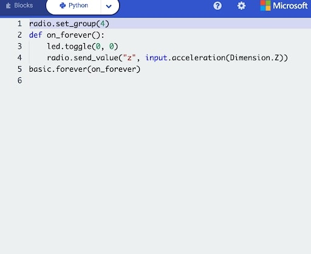
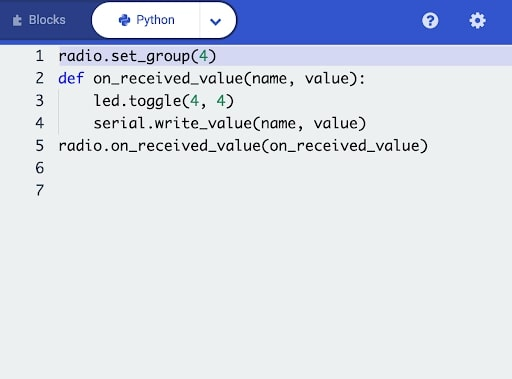
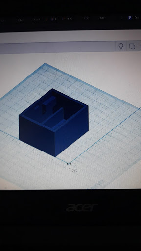

# Mission-to-Mars-Documentation

## Justins Cracked at Fortnite My Guy

### Process Overview

.jpg)

During most of the process involving Tinkercad, Jackson and I did most of the planning and design, going back and forth with ideas and such. In the beginning, we had a box of maximum dimensions. We first printed that, but then realized we needed to cut down on the weight and size, as well as the fact that our box had thick walls, which added to the weight. 
After another failed attempt, we made a box that was sustainable and could last longer than both combined, which was very stable. Though it took more time to print and shape when compared to our other attempts, it was more effective.

However, during the coding and pairing of the microbits, it was spearheaded by Jackson and Alex. 

#### Microbits

Shown first is the code for our microbit sender. It sets a group, 4, which both of the microbits share. (this can pair them together) as well as tells the microbit which LED to flash (or in the case of the sender, technically none since it is the sender, the receiver will do this), and to always be sending inputs of acceleration upon the Z axis to the receiver, to be able to determine the value when dropped from the balcony. 

This on the other hand, is the receiver. It tells the microbit to write names and values of the data/inputs it receives when it receives, on a constnat loop, and to flash it upon the microbit.

#### Box 

 
(Although at a bad angle) This was our final design. As you can see, the walls were slimmed down than compared our first and second designs. For our final design, we added the wall in the middle to hold the battery pack in place to prevent any disconnects or large bursts of movement. Visible at the top left of the box is a beam/wall. That is what we added to hold our microbit higher in the air, so it could be separated and above the battery pack. Originally, our second design, though not shown, was written off as a failure. We made a mistake when rendering, which caused part of the support (beams?) walls to print badly and fall off. That shows how we were able to make our container work even after a hefty setback.
 
* #### Reflection

The microbit and the final design of the box worked brilliantly. As a trio we were able to make it work, even with some distraction or goofing off, and did it well. The only thing we need in terms of improvement would be communication and teamwork. Communication in that we need to speak to each other all the time, and teamwork as in we need to do these assignments (specifically this) as a trio. 
